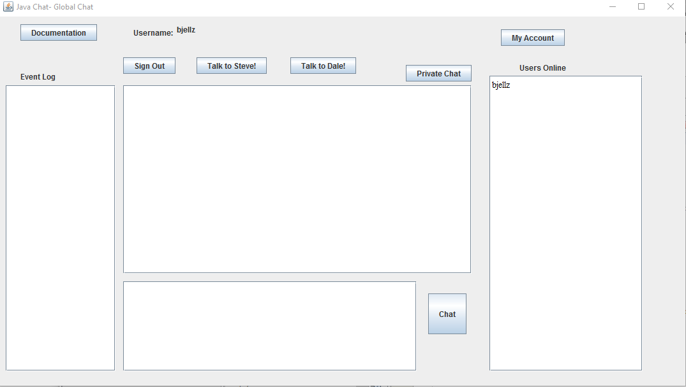
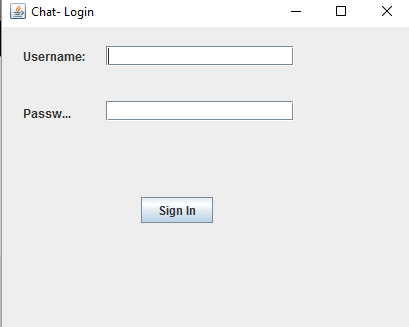
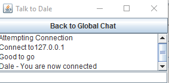

# Java Chat and Bot
## Table Of Contents
* [What Is This](#What-is-this "What is this")
* [Prerequisites](#Prerequisites "Prerequisites")
* [Quick Start](#Quick-Start "Quick Start")
* [Author](#Author "Author")
* [Screenshots](#Screenshot "Screenshots")
* [Licensing](#Licensing "Licensing")
<a name="What-is-this"><h1>What Is This</h1></a>
  
A chat program written in Java and makes a connection to a server via JDBC to find other connections

<a name="Prerequisites"><h1>Prerequisites</h1></a>
* Download and install [JDK 7+](http://www.oracle.com/technetwork/java/javase/downloads/index.html)
* Download and install [Netbeans](https://netbeans.org/downloads/)
* Download and install [WAMPserver](http://www.wampserver.com/en/)
<a name="Quick-Start"><h1>Quick Start</h1></a>
* Open Wampserver and navigate to PHPMyAdmin
* Create a new database called "java-chat" and import "java-chat.sql".
* Open Netbeans and open the two projects contained in the downloaded repo, Dalebot and Java Chat. Dalebot is simply a program waiting for an incomming socket connection from the Java Chat program.
* If you receive an error that the MySql driver cannot be found, it is in the dist/lib folder
<a name="Author"><h1>Author</h1></a>
  
This project was written for a Programming with Data Structures class at Quinsigamond Community College.
  This project was authored by William Jellesma. 

<a name="Screenshot"><h1>Screenshot</h1></a>

<a name="Licensing"><h1>Licensing</h1></a>

This Project is licensed under the <a href="http://choosealicense.com/licenses/mit/">MIT License</a>

